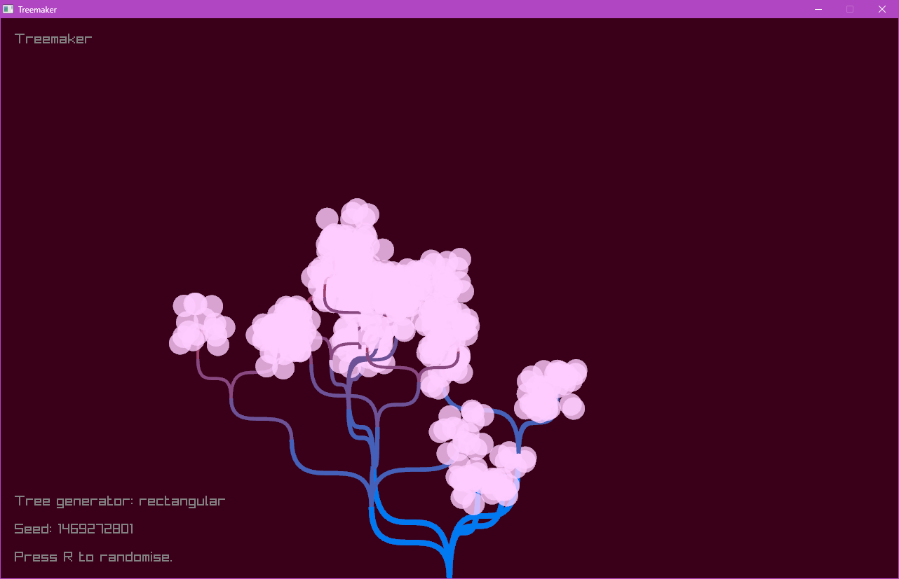
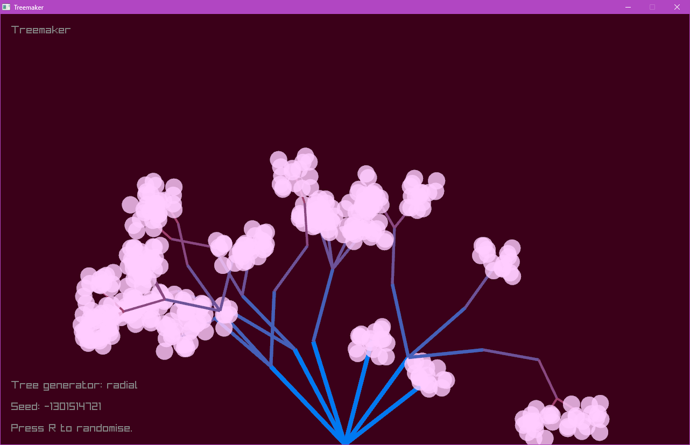
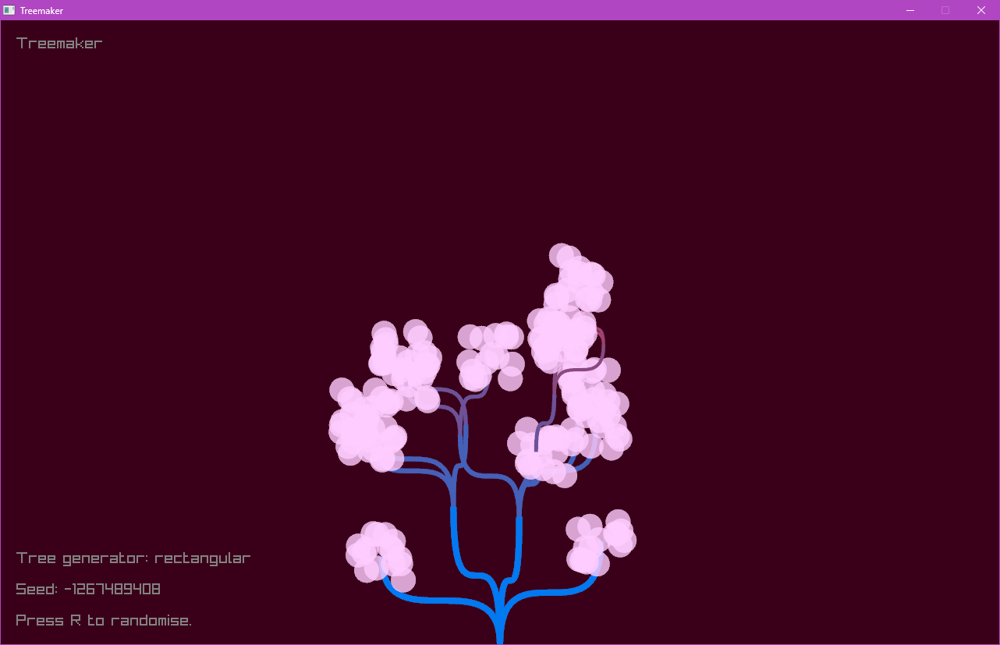

# TreeMaker

||||
|---|---|---|

Formerly unpublished minor project to acquaint with raylib, primarily based on [the project template created by Jeffery Myers](https://github.com/raylib-extras/raylib-quickstart).

Program procedurally generates two-dimensional trees via seeded pseudorandom number generation.

## Running

### Windows

Following instructions in the original repo, the Windows build process is generic between Visual Studio (`./build-VisualStudio2022.bat`) and MinGW (`./build-MinGW-W64.bat`). Of the two, MinGW was used for development.

### Linux

A makefile may be generated by running `premake5` within the build dir, then running `make` in project root.

For compiling, the following dependencies needed installation on my machine;
- libxrandr-dev
- libxcursor-dev
- libxinerama-dev
- libxi-dev

These packages may be installed [by following the instructions on the raylib wiki](https://github.com/raysan5/raylib/wiki/Working-on-GNU-Linux).